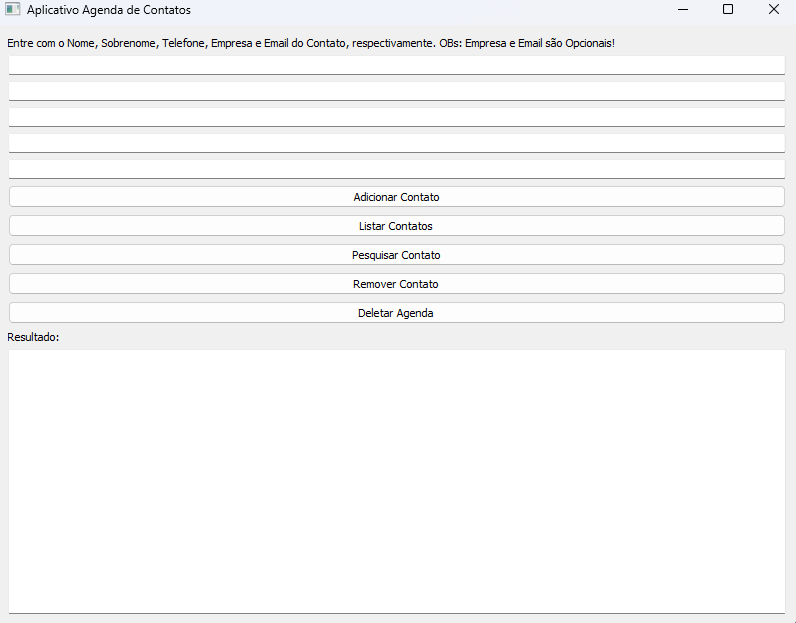

[](https://github.com/DouglasSouza05/Trabalho_Final_C214_Lab/actions/workflows/workflow.yml)

# Trabalho_Final_C214_Lab - Projeto Agenda

## Descrição

Este projeto consiste em uma agenda de contatos com interface gráfica desenvolvida em PyQt5. Oferece funcionalidades para adicionar, listar, pesquisar e remover contatos.



## Instalação

Certifique-se de ter o Python instalado. Em seguida, instale as dependências executando:

Instalação do pip como gerenciador de dependências

```
python -m pip install -U pip
```

Inclusão de todas as dependências do projeto

```
pip freeze > requirements.txt
```

Instalação das dependências

```
pip install -r requirements.txt
```

Certifique-se de ter as bibliotecas instaladas com os comandos:

```
pip install PyQt5
pip install xmlrunner
pip install unittest-xml-reporting
```

## Executando o Projeto

Execute o seguinte comando no terminal:

```
python agendaApp.py
```

Uma janela de interface gráfica será aberta, permitindo interações com a agenda de contatos.

## Testes

Os testes podem ser rodados todos de uma vez pelo comando:

```
python -m unittest -v
```

ou simplesmente rodá-los individualmente, na própria IDE utilizada ou por linha de comando:
Exemplo: `python nome_do_teste.py `

## Resultados

Temos como resultado dos testes:

```
test_formatar_contato (test_config.TestConfig.test_formatar_contato)
 Testa se a função formatar_contato da classe Config formata corretamente um objeto Contato. ... ok
 test_formatar_contato_diferente (test_config.TestConfig.test_formatar_contato_diferente)
 Testa se a função formatar_contato da classe Config gera resultados diferentes para contatos distintos. ... ok
 test_formatar_json (test_config.TestConfig.test_formatar_json)
 Testa se a função formatar_json da classe Config gera corretamente um JSON a partir de um objeto Contato. ... ok
 test_formatar_json_diferente (test_config.TestConfig.test_formatar_json_diferente)
 Testa se a função formatar_json da classe Config gera resultados diferentes para contatos distintos. ... ok
 test_formatar_json_e_contato (test_config.TestConfig.test_formatar_json_e_contato)
 Testa se a função formatar_json e formatar_contato da classe Config geram resultados diferentes para o mesmo contato. ... ok
 test_getters (test_contatos.TestContato.test_getters) ... ok
 test_nome_diferente (test_contatos.TestContato.test_nome_diferente) ... ok
 test_setters (test_contatos.TestContato.test_setters) ... ok
 test_sobrenome_diferente (test_contatos.TestContato.test_sobrenome_diferente) ... ok
 test_telefone_diferente (test_contatos.TestContato.test_telefone_diferente) ... ok
 test_adicionar_contato (test_gerenciador.TestGerenciador.test_adicionar_contato) ... ok
 test_listar_contatos (test_gerenciador.TestGerenciador.test_listar_contatos) ... ok
 test_pesquisar_contato_existente (test_gerenciador.TestGerenciador.test_pesquisar_contato_existente) ... ok
 test_pesquisar_contato_inexistente (test_gerenciador.TestGerenciador.test_pesquisar_contato_inexistente) ... ok
 test_remover_contato_existente (test_gerenciador.TestGerenciador.test_remover_contato_existente) ... Nenhum contato para salvar.
 ok
 test_remover_contato_inexistente (test_gerenciador.TestGerenciador.test_remover_contato_inexistente) ... ok


Ran 16 tests in 0.004s

OK
```

Os arquivos artefatos dos resultados que são criados após os testes são os de extensão .xml:

> resultados_testes_config.xml

> resultados_testes_contatos.xml

> resultados_testes_gerenciador.xml

## DevOps

Pode ser verificado pelo Actions do repositório deste trabalho, identificando os steps Build, test e notification, e também o Bedge do início deste README que mostra os testes passando e que tudo funciona correto em nosso pipeline.
Sendo responsáveis por tal operação os arquivos .github\workflows\workflow.yml e scripts\email.sh.

## Participantes do projeto:

Douglas Brandão de Souza GEC 1730

Eduardo Costa Resende GES 200

Lucas Brandão Costa GES 58

Lucas de Souza Resende 01 GES
